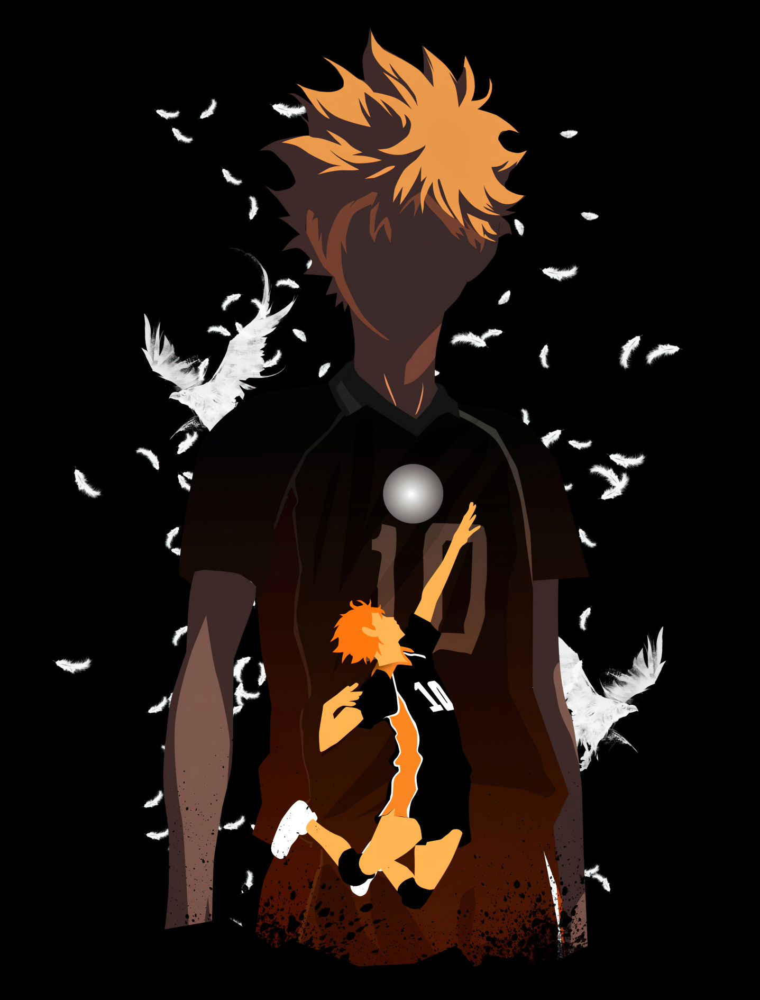

<!DOCTYPE html>
<html lang="en">
<head>
    <meta charset="UTF-8">
    <meta name="viewport" content="width=device-width, initial-scale=1.0">
</head>
<body style="width: 1000px">

<h1>👋 Hi, I'm Gabriela (also known as Gabi)</h1>

<table>
    <tr>
        <td class="image-table" style="width: 500px">
            
        </td>
        <td class="info-table" style="width: 500px">
            <h2>🚀 About me</h2>
            
I'm really passionate about the field of cybersecurity right now. I actually started out in programming, so I know my way around Python, Javascript (HTML/CSS), C#, PHP, and I'm always eager to learn new things. My next goal is to dive deeper into Golang. On the cybersecurity front, I'm taking courses and honing my skills. I'm also open to job opportunities, even if they're unpaid, because I want to gain more experience.

        <h2>🌱 Currently Studying</h2>
        
I'm dedicating time to improving my python and pentest skills.

        <h2>📫 How to Get in Touch with me</h2>
        <ul>
            <li>LinkedIn: <a href="https://www.linkedin.com/in/gabrieladsalvarenga/">LinkedIn</a></li>
            <li>E-mail: <a href="mailto:gabrielasalvarenga2@gmail.com">E-mail</a></li>
            <li>Github for minor projects: <a href="https://github.com/gabrieladsalv-projects">other Github</a></li>
        </ul>
        <h2>📈 Github Statistics</h2>
        

            
            
        

        <h2>⚡ Curiosities</h2>
        <ul>
            <li>I've been in and out of the IT world for a few years now, but I always end up coming back to it because it's one of my obsessions. I can't even count how many times I've pulled all-nighters coding some random project, but it's such a rush when I finally get it done. Lately, I'm leaning more towards cybersecurity, learning about scans and enumerations and loving every minute of it.</li>
            <li>As a neurodivergent person (autistic with ADHD), since my teenage years I have my hyperfixations in the IT field, and quite often, I lose track of time and end up spending days on the same project without even realizing it. I still can't say whether this is a quality or a flaw.</li>
        </ul>
        

            Made with ❤️
        

        </td>
    </tr>
</table>

</body>
</html>
